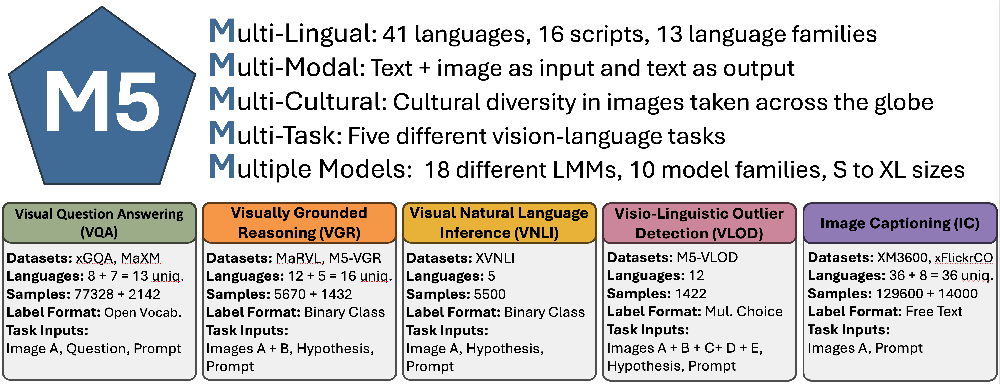

# M5 - A Diverse Benchmark to Assess the Performance of Large Multimodal Models Across Multilingual and Multicultural Vision-Language Tasks

This repository contains the code for the [M5 Benchmark](https://arxiv.org/abs/2407.03791) paper.



## News

- **2024-10**: We are currently working on M5 Benchmark v2 with a cleaner and more extendable codebase, support for more models, and additional datasets.
- **2024-10**: ⭐️ We publicly released the code for the M5 Benchmark.
- **2024-09**: ⭐️ Our paper got accepted at EMNLP (Findings) 2024, Miami, FL, USA.
- **2024-07**: We released the first preprint of the [M5 Benchmark paper](https://arxiv.org/abs/2407.03791).

## Setup

Note that all code was tested only on Debian-based systems (Ubuntu 20.04 and 22.04) with CUDA 11.8 pre-installed.

To setup the environments, run the `setup.sh` script:

```bash
./setup.sh
```

This takes a long time (!) and will:

1. Install the `mamba` package manager if not already installed.
2. Create the following mamba environments:
    - `m5b` for the majority of the models
    - `m5b-cogvlm` for the CogVLM models
    - `m5b-yivl` for the Yi-VL models. Note that this also downloads the model weights.
    - `m5b-llava` for the original LlaVA models from  Haotian Liu
    - `m5b-omnilmm` for the OmniLMM models
    - `m5b-qwenvl` for the QwenVL models
3. Tests each environment to ensure that it is correctly setup.

You can also install single environments by running the following command:

```bash
./setup.sh mamba-env-create <env_name>
```

where `<env_name>` is one of the environments listed above.

If the installation was successful, you should see a message similar to the following for each environment:

```bash
##################### PYTHON ENV 'm5b-llava' INFO START #####################
Python version: 3.10.15 | packaged by conda-forge | (main, Jun 16 2024, 01:24:24) [GCC 13.3.0]
PyTorch version: 2.1.2
CUDA available: True
CUDA version: 11.8
CUDA devices: 5
Flash Attention 2 Support: True
Transformers version: 4.37.2
Datasets version: 3.0.1
Lightning version: 2.4.0
##################### PYTHON ENV 'm5b-llava' INFO END #####################
```

### Getting the Data

To speed up the evaluation process, the datasets of the M5 Benchmark are stored as WebDataset archives. You can download all datasets as a single `46G` tar-archive using the following command:

```bash
curl https://ltdata1.informatik.uni-hamburg.de/m5b/m5b_datasets.tar -o /path/to/the/m5b/datasets/m5b_datasets.tar \
&& tar -xvf /path/to/the/m5b/datasets/m5b_datasets.tar
```

## Evaluate a Model

### Available Models

Because different models require different environments, you have to activate the correct environment before running the benchmark.

| Model ID | Environment |
| --- | --- |
| [`🤗/openbmb/MiniCPM-V`](https://hf.co/openbmb/MiniCPM-V) | `m5b` |
| [`🤗/Gregor/mblip-mt0-xl`](https://hf.co/Gregor/mblip-mt0-xl) | `m5b` |
| [`🤗/Gregor/mblip-bloomz-7b`](https://hf.co/Gregor/mblip-bloomz-7b) | `m5b` |
| [`🤗/llava-hf/bakLlava-v1-hf`](https://hf.co/llava-hf/bakLlava-v1-hf) | `m5b` |
| [`🤗/llava-hf/llava-1.5-7b-hf`](https://hf.co/llava-hf/llava-1.5-7b-hf) | `m5b` |
| [`🤗/llava-hf/llava-1.5-13b-hf`](https://hf.co/llava-1.5-13b-hf) | `m5b` |
| [`🤗/OpenGVLab/InternVL-Chat-Chinese-V1-1`](https://hf.co/OpenGVLab/InternVL-Chat-Chinese-V1-1) | `m5b` |
| [`🤗/OpenGVLab/InternVL-Chat-Chinese-V1-2-Plus`](https://hf.co/OpenGVLab/InternVL-Chat-Chinese-V1-2-Plus) | `m5b` |
| [`🤗/liuhaotian/llava-v1.6-vicuna-7b`](https://hf.co/liuhaotian/llava-v1.6-vicuna-7b) | `m5b-llava` |
| [`🤗/liuhaotian/llava-v1.6-vicuna-13b`](https://hf.co/liuhaotian/llava-v1.6-vicuna-13b) | `m5b-llava` |
| [`🤗/liuhaotian/llava-v1.6-34b`](https://hf.co/liuhaotian/llava-v1.6-34b) | `m5b-llava` |
| [`🤗/THUDM/cogvlm-chat-hf`](https://hf.co/THUDM/cogvlm-chat-hf) | `m5b-cogvlm` |
| [`🤗/01-ai/Yi-VL-6B`](https://hf.co/01-ai/Yi-VL-6B) | `m5b-yivl` |
| [`🤗/01-ai/Yi-VL-34B`](https://hf.co/01-ai/Yi-VL-34B) | `m5b-yivl` |
| [`🤗/openbmb/OmniLMM-12B`](https://hf.co/openbmb/OmniLMM-12B) | `m5b-omnilmm` |
| [`🤗/Qwen/Qwen-VL-Chat`](https://hf.co/Qwen/Qwen-VL-Chat) | `m5b-qwenvl` |
| `gpt-4-turbo-2024-04-09` | `m5b` |
| `gpt-4-1106-vision-preview` | `m5b` |
| `gpt-4-turbo` | `m5b` |
| `gpt-4-vision-preview` | `m5b` |
| `gemini-pro-vision` | `m5b` |

### Available Datasets

The M5 Benchmark consists of the following datasets:
 marvl xgqa xm3600 xvnli maxm xflickrco m5b_vgr m5b_vlod

| Dataset ID | Name |
| --- | --- |
| `marvl` | MaRVL: Multicultural Reasoning over Vision and Language|
| `xgqa` | xGQA: Cross-Lingual Visual Question Answering |
| `xm3600` | Crossmodal-3600: A Massively Multilingual Multimodal Evaluation Dataset |
| `xvnli` | Zero-Shot Cross-Lingual Visual Natural Language Inference |
| `maxm` | MaXM: Towards Multilingual Visual Question Answering |
| `xflickrco` | xFlickrCOCO |
| `m5b_vgr` | M5B Visually Grounded Reasoning |
| `m5b_vlod` | M5B Visual Outlier Detection |

### Running the evaluation for a single model on a single dataset

First, activate the correct environment for the model you want to evaluate as described above.
Then, in the project root, run the following command:

```bash
PYTHONPATH=${PWD}/src python src/m5b/scripts/eval.py \
    --model_id="<model_id>" \
    --dataset="<dataset_id>" \ 
    --data_base_path=/path/to/the/m5b/datasets
```

where `<model_id>` is the model ID from the models table above and `<dataset_id>` is the dataset ID from the datasets table above.

## Citation

If you use this code or the M5 Benchmark in your research, please cite the following paper:

```bibtex
@inproceedings{
    schneider2024m5benchmark,
    title={M5 -- A Diverse Benchmark to Assess the Performance of Large Multimodal Models Across Multilingual and Multicultural Vision-Language Tasks},
    author={Schneider, Florian and Sitaram, Sunayana},
    booktitle={Findings of the Association for Computational Linguistics: EMNLP 2024},
    address={Miami, Florida, USA},
    publisher = "Association for Computational Linguistics",
    url = "https://aclanthology.org/2024.findings-emnlp.250",
    pages={4309--4345},
    year={2024}
}
```
